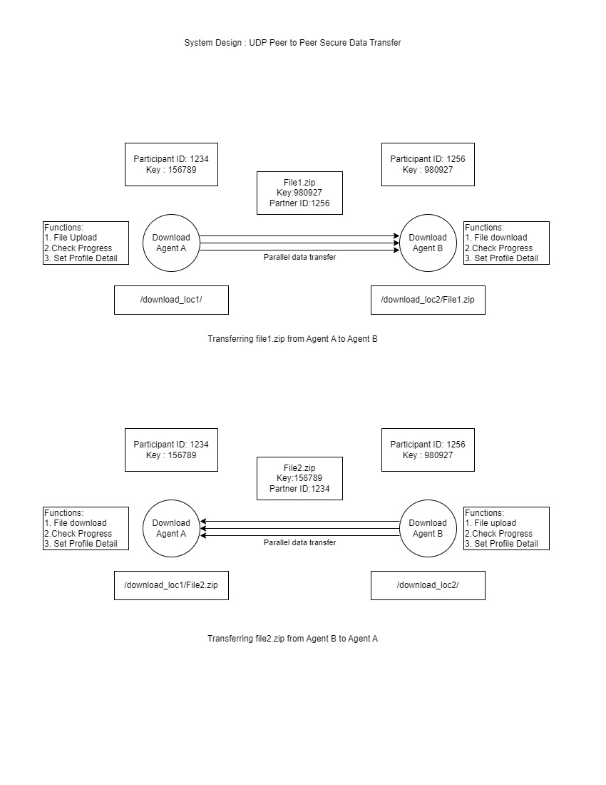

# UDP Peer to Peer Secure Data Transfer
## Tasks
| Task | Date Started | Date Completed | Notes | PRs | Issue |
| -------- | ------- | ----------|-----|-----|-------- |
| Repo Creation | 05-02-2022 | 05-02-2022 | | | |
| Requirement Doc | 06-02-2022 | 09-02-2022 | | | |

## Overview

This project aims to implement secure, high-speed peer-to-peer data transfer between two agents (Data Foundation and Partner) using NodeJS servers. The transfer uses UDP for data transfer and TCP for transfer quality control. The project involves creating Data Transfer Profiles for each agent, which include details such as IP addresses, host names, and port details. The data transfer is initiated by setting up a transfer request with parameters such as number of threads, IP addresses, and schedule time. The project includes a web-based monitoring system to monitor the data transfer session. Additionally, the project involves integrating the Data Foundation with the file system and MinIO.

**Use cases for this platform include**:

- Educational: The platform could be used in educational institutions for transferring large amounts of data, such as video lectures or research papers, between teachers and students or between different departments within the same institution.
- Research: Researchers can use the platform to transfer large amounts of data, such as scientific data or simulations, between different research institutions or between researchers working on the same project.
- Industry: Companies could use the platform for secure, high-speed transfer of large amounts of data, such as financial data or customer data, between different departments within the company or between different companies.
- Community building: The platform could be used to transfer large amounts of data, such as event videos or community resources, between different communities or between members within a community.
- Competition: The platform could be used for secure, high-speed data transfer during competitions, such as programming competitions, where large amounts of data, such as code submissions or testing data, need to be transferred quickly and securely between participants and organizers.

---

## Requirements

UDP Peer to Peer Secure Data Transfer
- Secure high speed peer to peer data transfer from/to Data Foundation Server
- Data Transfer between two Agents (Data Foundation and Partner ) with the help of NodeJS servers
    - UDP for data transfer
    - TCP for transfer quality control
- Data Foundation and Partner Data Tansfer Profile detail:
    - Data Foundation Agent(s) Details: Partner ID, Partner Public Key, Partner Private Key, Data Send / Receive directory, Host name, IP Address, port details
    - Partner Agent(s) Details: Partner ID, Partner Public Key, Partner Private Key, Data Send / Receive directory, Host name, IP Address, port details
- Data Transfer Request Setup ( Sender and Receiver DT Profiles, Transfer Configuration: (#threads, IP addresses, ports, schedule time, # of files, Total Files Size, md key)
- Add Files
- Schedule/initiate Data Transfer Request
- DT Profile key verification. On success, Initiate Data transfer (send / receive)
- Data Transfer Session Monitor ( Web based monitoring)
- Data Foundation Integration: File System Integration + MinIO Integration

## Technical Requirements

### Software Requirements
The project will mostly be based on Node js. The parsing, validation, uploading, and
downloading of the data will be handled with dedicated Node js objects or modules.
The UI section of the project will be based on javascript, in particular , react js, which enables us to create a suitable reactJS web application allowing client-side users to easily upload and download files. JSon file can be used to keep track of the necessary configurations of the file transfer system.

--- 

### Hardware Requirements
Two systems will be required. One will be acting as client uploading the file. Another for acting as client uploading the file. Systems should have capable enough processor as applications can handle information at a faster speed. (preferably with 4 core or more). A high speed internet connection be needed.

## Scope
- iUsing NodeJS servers, two agents (Data Foundation and Partner) can exchange data at rapid speeds between each other while being secure.
- Data Transfer Session Monitor ( Web based monitoring)
- Data Foundation Integration: File System Integration + MinIO Integration

## System Design 

## Pipeline and Workflow

**ER Diagram and Design**

**Pipeline Design**

### **Workflow of the System**

The traditional mode of file transmission involves multiple steps and can be time-consuming. To address this issue, our team has developed a point-to-point transfer mode that enables end-to-end file transmission between users in a single step. Here's how it works:

---
- Step1. The recipient logs into the website and navigates to the "Point-to-Point" transfer page. They enable the option "Allow to receive direct transfer files from partners," which displays their unique ID and Key. The recipient then provides this information to the sender.
- Step 2. The recipient runs the client and selects the "Direct Transfer" option, and sets the desired save path for received files.
- Step 3. The sender logs into the client and clicks "Start to Transfer File" in the "Point-to-Point" page. They enter the recipient's ID and Key to initiate the transfer. The recipient's client will automatically start receiving the file.
- Step 4. Once the transfer is complete, the recipient can open the local directory and view the received file.

This streamlined process enables quick and efficient file transfer without the need for intermediate servers or links, saving time and reducing complexity.

